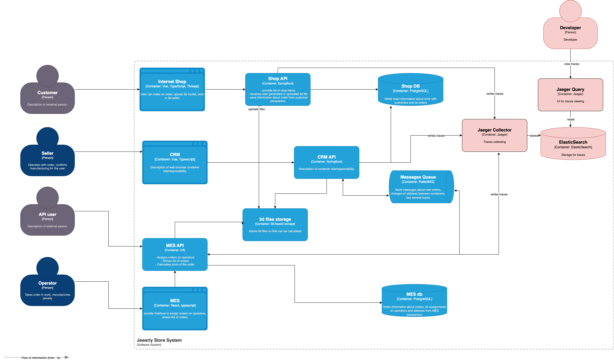

# Архитектурное решение по трейсингу

### Точки потери заказов
- ShopApi -> RabbitMQ
- RabbitMQ -> MES API
- MES API -> Rabbit MQ
- RabbitMQ -> CRM API
- RabbitMQ DLQ

### Мотивация

**Проблема**: теряются заказы, диагностика затрудена, так как нет понимания в какой системе потерялся заказ

**Влияние на метрики**:
- Среднее время решения инцидента *снизится*
- Количество жалоб на потерю заказа *снизится*
- Удовлетворенность пользователей *вырастет*
- Количество жалоб на просроченные заказы *снизится*

### Предлагаемое решение

Используем OpenTelemetry и Jaeger

Системы для внедрения трейсинга:
- Shop API
- CRM API
- MES API
- RabbitMQ

Поля трейсов:
- trace_id
- span_id
- parent_span_id
- user_id
- order_id
- service
- operation
- status
- timestamp
- error

Для внедрения в сервисы используем OpenTelemetry SDK
Для сбора с сервисов используем Jaeger Collector и Elasticsearch для хранения
Для сбора трейсов с RabbitMQ используем передачу trace context через headers
Для просмотра используем Jaeger UI

Диаграмма C4:

### Компромиссы
- Хранение трейсов требует ресурсов
- overhead на производительность 1-3%
- Требуются доработки во всех сервисах

### Аспекты безопасности
- Доступ в Jaeger только для DevOps и разработчиков
- Аутентификация: Nginx как reverse proxy с Basic Auth
- Не логировать персональные данные в спанах
- Доступ к Jaeger UI только из внутренней сети

### Автоматический мониторинг
- Интеграция с Prometheus Alertmanager для уведомлений в мессенджер или на почту
- Алерт если заказ в статусе `STATUS_I` более threshold1 минут без перехода в `STATUS_{I+1}`
- Алерт если span duration превышает threshold2

