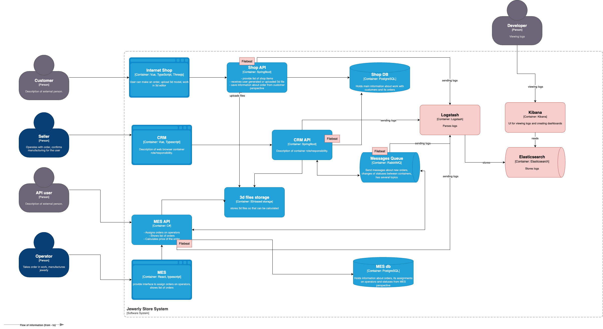

# Архитектурное решение по логированию

### Анализ

Системы для сбора логов:
1. MES - потеря заказов, долгое время ответа на главной страница
2. CRM - возможна потеря заказов
3. Shop - возможна потеря заказов
4. RabbitMQ - возможна потеря заказов между системами

INFO логи:
- Создание заказа, labels: timestamp, user_id, order_id, source
- Смена статуса заказа, labels: timestamp, order_id, old_status, new_status, system
- Загрузка 3d-модели, labels: timestamp, order_id, filesize
- Расчет стоимости, labels: timestamp, order_id, duration_ms, price
- Отправка/получение сообщения RabbitMQ, labels: timestamp, queue, message_id, order_id
- Вход пользователя, labels: timestamp, user_id, role, ip

WARN:
- Долгий расчет стоимости
- Retry отправки сообщений

ERROR:
- Ошибки API
- Ошибка при рассчете стоимости
- Ошибки запросов к БД

### Мотивация

**Проблема**: cейчас разбор инцидента начинается с жалоб клиентов, невозможно автоматически определять проблемы на основе логов

**Влияние на метрики**:
- Среднее время решения инцидента *снизится*
- Количество жалоб на потерю заказа *снизится*
- Удовлетворенность пользователей *вырастет*
- Количество жалоб на просроченные заказы *снизится*

### Приоритеты внедрения

Так как команда не может реализовать логирование и трейсинг во всех системах одновременно, предлагается следующий порядок внедрения:

1. **RabbitMQ и MES API** (1-й этап)
Основная проблема — потеря заказов.
RabbitMQ — это связующее звено между сервисами с большим риском потери.
MES API — место, где операторы видят заказы и меняют их статусы

2. **Shop API** (2-й этап)
Точка входа для создания заказов

3. **CRM API** (3-й этап)
Менее критично, так как CRM работает уже с подтвержденными заказами

### Предлагаемое решение

Используем ELK (ElasticSearch, Logstash, Kibana)

Пишем логи в формате JSON
В каждом сервисе добавляется Filebeat агент
Logstash отвечает за парсинг, обагощение, фильрацию логов
ElasticSearch отвечает за хранение логов
Kibana отвечает за визуализацию логов, построение дашбордов поверх логов

### Политика безопасности
- Аутентификация через nginx как reverse proxy с basic auth
- Персональные данные маскируем или не логируем
- Доступ к логам только у разработчиков и DevOps
- Доступ к логам только из внутренней сети
- Политика хранения
    - prod: 7 дней hot, 30 дней warm, 365 дней cold, затем удаление
    - release: 14 дней hot, затем удаление
    - dev: 7 дней hot, затем удаление
    - Ожидаемый размер prod: ~5 GB/день, ~50 GB hot, ~150 GB warm, ~1.5 TB cold

Диаграмма C4:

### Анализ логов
- Алертим на число ошибок в минуту больше threshold
- Алертим на отсутствие заказов за интервал
- Алертим на аномальный RPS
- Дашборд статуса заказов
- Дашборд количества ошибок по сервисам

### Выбор технологии

| Критерий | ELK | OpenSearch |
|----------|-----|------------|
| Зрелость экосистемы | Высокая, 10+ лет на рынке | Средняя, форк 2021 года |
| Документация и community | Больше примеров | Меньше примеров, активно растет |
| Интеграции | Beats, Logstash, APM, SIEM | Базовая совместимость с Beats |
| Функциональность Kibana | Полная, включая ML и Canvas | OpenSearch Dashboards — урезанный форк |
| Лицензия | Elastic License 2.0 | Apache 2.0 |

**Выбор: ELK**

Обоснование:
- Для небольшой команды важнее зрелость экосистемы и документации
- Kibana имеет больше возможностей для построения дашбордов и алертинга
- Elastic License не ограничивает для внутреннего использования
- Больше интеграций из коробки
