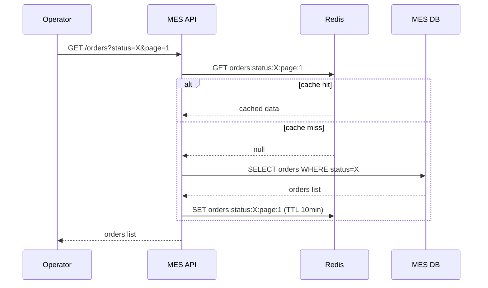
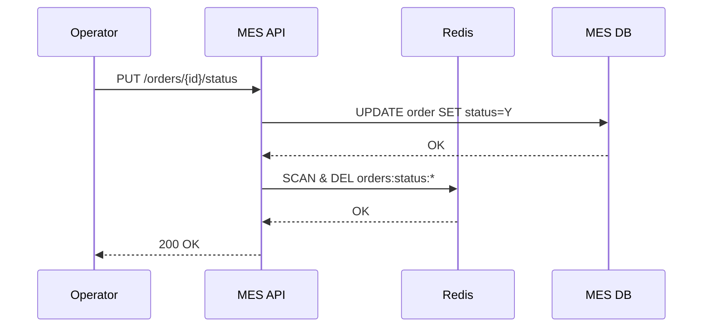

# Архитектурное решение по кешированию

### Анализ и мотивация
Главная страница MES медленно загружается, внедрение пагинации и фильтрации не помогло.
При росте числа заказов тяжёлый запрос к БД будет работать ещё медленнее, необходимо закешировать список заказов.

Кэшируем результат запроса списка заказов по ключу `orders:status:{status}:page:{n}`

### Предлагаемое решение

Клиентское кэширование использовать нельзя, так как данные быстро меняются и клиентский кэш будет очень быстро устаревать

**Сравнение паттернов кеширования:**
- Cache-Aside: подходит так как читаем чаще, чем пишем, есть полный контроль над тем что попадает в кэш
- Write-Through: избыточно обновлять кэш на каждом обновлении заказа, если данные не запрашиваются оператором
- Refresh-Ahead: сложнее в реализации

Для серверного кэширования будет использован Redis со стратегией Cache-Aside.

**Чтение списка заказов:**

**Изменение статуса заказа:**

Так как Redis не поддерживает удаление через wildcard сначала список ключей на удаление будет сформирован через SCAN

### Стратегия инвалидации

**Сравнение стратегий:**
- Только TTL: так как данные могут быть неактуальны до N минут, операторы потеряют новые заказы
- Только программная: нет гарантии очистки устаревших данных
- По ключу: при смене статуса заказа затрагиваются несколько ключей (старый и новый статус), из-за пагинации придется инвалидировать много кэшей с разным ключом

Оптимально комбинировать TTL и программную

Была выбрана комбинированная инвалидация кэша:
- TTL кэша 10 минут
- Программная инвалидация при изменении статуса заказа (`DEL orders:status:*`)
